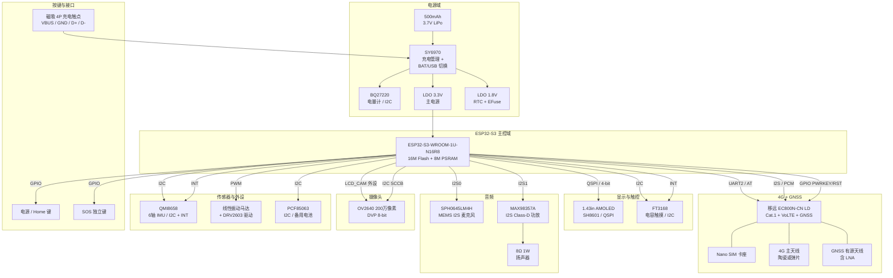
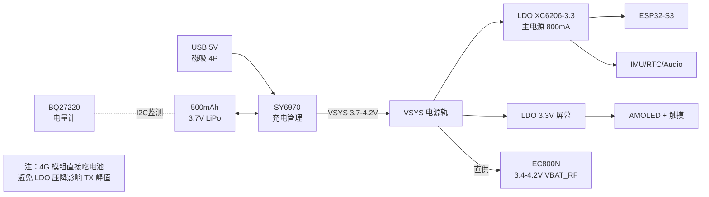
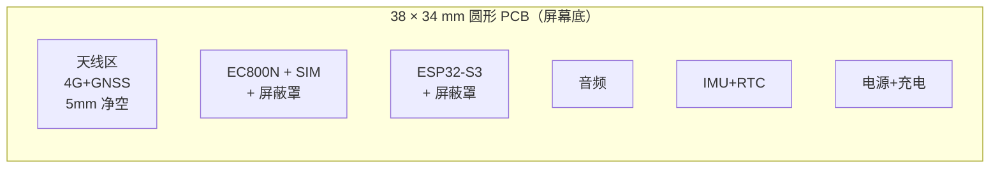

# 03 - 硬件设计

> 文档编号：HW
> 适用版本：V1
> 状态：设计阶段（P0 原型用 Waveshare 开发板 + EC800N 评估板验证，自研 PCB 在 P4 阶段交付）

---

## 1. 系统框图



---

## 2. 完整 BOM 清单

> 价格为 2026 年 Q2 单台估算（小批量 / 4 片打样均摊），单位人民币。

### 2.1 核心元器件

| 类别 | 型号 | 数量 | 单价 | 小计 | 关键参数 |
|---|---|---|---|---|---|
| MCU | ESP32-S3-WROOM-1U-N16R8 | 1 | 28 | 28 | 16MB Flash + 8MB PSRAM, 外置天线版 |
| 4G+GNSS | 移远 EC800N-CN LD | 1 | 55 | 55 | Cat.1 + VoLTE + GPS/BDS/GLO/GAL |
| 显示模组 | 1.43" AMOLED 466×466 + SH8601 + FT3168 | 1 | 90 | 90 | QSPI + I2C 触摸 |
| IMU | QMI8658C | 1 | 8 | 8 | 6 轴 加速度+陀螺，I2C |
| MEMS 麦克风 | SPH0645LM4H | 1 | 7 | 7 | I2S 24-bit |
| 音频功放 | MAX98357A | 1 | 4 | 4 | I2S → 8Ω 1W |
| 扬声器 | 8Ω 1W 微型方形 | 1 | 5 | 5 | 12×10×3mm |
| 摄像头 | OV2640 + 镜头模组 | 1 | 18 | 18 | 2MP DVP，含 22mm 软排线 |
| RTC | PCF85063A | 1 | 3 | 3 | I2C，备用电池端 |
| 电池 | 503040 / 502525 LiPo 500mAh | 1 | 12 | 12 | 3.7V 单节，带保护板 |
| 充电管理 | SY6970 | 1 | 5 | 5 | USB / BAT 切换 + 充电 |
| 电量计 | BQ27220YZFR | 1 | 8 | 8 | I2C 燃料计 |
| 振动马达 | 线性马达 1027 | 1 | 4 | 4 | 3V，约 30g 振感 |
| 马达驱动 | DRV2603 / 简化版三极管 | 1 | 1 | 1 | 单 PWM 驱动 |
| Nano SIM 卡座 | Molex 78800 翻盖 | 1 | 5 | 5 | 推拉式 |

**核心小计**：约 253 元

### 2.2 RF 与天线

| 元件 | 数量 | 单价 | 小计 |
|---|---|---|---|
| 4G 主天线（陶瓷或 FPC） | 1 | 15 | 15 |
| GNSS 有源天线（含 LNA） | 1 | 12 | 12 |
| 同轴线 IPEX U.FL | 2 | 1 | 2 |
| RF 匹配电容 + 电感 | 一套 | 5 | 5 |

**RF 小计**：34 元

### 2.3 被动元件 + 接插件

| 类别 | 数量 | 估算单价 | 小计 |
|---|---|---|---|
| 电阻（0402） | 80 | 0.02 | 1.6 |
| 电容（0402/0805） | 60 | 0.03 | 1.8 |
| 电感（绕线/磁珠） | 10 | 0.5 | 5 |
| TVS / ESD 保护 | 8 | 0.5 | 4 |
| MOSFET / 三极管 | 6 | 0.8 | 4.8 |
| LDO（XC6206 等） | 2 | 1 | 2 |
| 磁吸充电触点 4P | 1 | 8 | 8 |
| Type-C 调试座（仅打样板） | 1 | 2 | 2 |
| 按键（侧键 + SOS） | 2 | 1 | 2 |
| 0.4mm BTB 排针（屏幕扩展） | 一套 | 5 | 5 |

**被动元件小计**：36 元

### 2.4 PCB 与制造

| 项目 | 数量 | 单价 | 小计 |
|---|---|---|---|
| 4 层 PCB（嘉立创 SMT，4 片，38×34mm） | 4 | 175 | 700 |
| 钢网 | 1 | 50 | 50 |
| 备料损耗 | - | - | 150 |

**PCB 制造小计**：900 元（4 片 / 均摊 225 元/台）

### 2.5 结构件

| 项目 | 数量 | 单价 | 小计 |
|---|---|---|---|
| SLA 树脂表壳（3 版迭代 × 4 套） | 12 | 25 | 300 |
| 22mm 硅胶儿童表带 | 4 | 30 | 120 |
| O 型圈 + 硅胶密封圈 | 一套 | 10 | 10 |
| Torx M1.4 防拆螺丝 | 一包 | 5 | 5 |
| UV 胶（卡固定） | 1 | 15 | 15 |
| 屏幕 OCA 全贴合 | 4 | 20 | 80 |

**结构件小计**：530 元（4 台均摊 132 元/台）

### 2.6 BOM 总览（4 台样机 + 试错损耗）

| 类别 | 4 台合计 | 均摊单台 |
|---|---|---|
| 核心元器件 | 253 × 4 = 1012 | 253 |
| RF 与天线 | 34 × 4 = 136 | 34 |
| 被动元件 + 接插件 | 36 × 4 = 144 | 36 |
| PCB 制造 | 900 | 225 |
| 结构件 | 530 | 132 |
| **合计** | **~2722 元** | **~680 元/台** |

**总预算 ≤ 3000 元** ✅ 满足精益实践档约束。

---

## 3. 电源树



### 3.1 电源轨规划

| 电源轨 | 电压 | 容量 | 负载 | 备注 |
|---|---|---|---|---|
| VBUS | 5V | 1A | 仅充电 | 磁吸接入 |
| VSYS | 3.7-4.2V | 1A | EC800N + 充电 | 直供 RF 模组 |
| VDD_3V3_MAIN | 3.3V | 800mA | ESP32 + 传感器 + 音频 | LDO 800mA |
| VDD_3V3_LCD | 3.3V | 200mA | AMOLED + 触摸 | 独立 LDO 避免 RF 干扰 |
| RTC_BAT | 1.5-3V | μA | PCF85063 备用 | 钮扣电池或超级电容 |

### 3.2 EC800N 直供 VSYS 的关键设计

- EC800N 的 VBAT_RF 需要 **3.4-4.2V**，电流峰值 **2A**（Cat.1 TX 时）
- 不能用 LDO 降压：LDO 压差 + 电流会损耗严重
- 直接接电池：4G 模组与电池之间走粗铜（≥ 30 mil）
- 必须并联 470μF + 100μF + 1μF + 100nF 多级去耦电容，紧靠模组 VBAT_RF 引脚
- 锂电池保护板限流 ≥ 3A（用普通 1A 保护板会被 TX 峰值触发过流保护）

---

## 4. GPIO 资源分配（ESP32-S3）

ESP32-S3 共 45 个 GPIO，本设计使用约 36 个。预留 9 个以备未来扩展。

| GPIO | 方向 | 用途 | 备注 |
|---|---|---|---|
| GPIO0 | I | BOOT 键 | 用做侧键 / 调试 |
| GPIO1 | O | DBG_UART_TX | 调试串口（生产关闭） |
| GPIO2 | I | DBG_UART_RX | 调试串口 |
| GPIO3 | I | SOS_KEY | SOS 独立按键，硬下拉 |
| GPIO4 | I | POWER_KEY | 电源 / Home 键 |
| GPIO5 | O | LCD_CS | AMOLED 片选 |
| GPIO6 | O | LCD_SCK | QSPI 时钟 |
| GPIO7 | I/O | LCD_D0 | QSPI 数据 0 |
| GPIO8 | I/O | LCD_D1 | QSPI 数据 1 |
| GPIO9 | I/O | LCD_D2 | QSPI 数据 2 |
| GPIO10 | I/O | LCD_D3 | QSPI 数据 3 |
| GPIO11 | O | LCD_RST | AMOLED 复位 |
| GPIO12 | O | LCD_TE | Tearing Effect 同步 |
| GPIO13 | O | TP_RST | 触摸复位 |
| GPIO14 | I | TP_INT | 触摸中断 |
| GPIO15 | I/O | I2C_SCL | 共享 I2C：TP + IMU + RTC + Fuel |
| GPIO16 | I/O | I2C_SDA | 共享 I2C |
| GPIO17 | O | LTE_PWRKEY | EC800N 上电键 |
| GPIO18 | O | LTE_RST | EC800N 复位 |
| GPIO19 | I | LTE_RI | Ring Indicator |
| GPIO20 | I | LTE_STATUS | 模组状态指示 |
| GPIO21 | O | LTE_UART_TX | UART2 → EC800N（AT） |
| GPIO47 | I | LTE_UART_RX | UART2 ← EC800N |
| GPIO48 | O | LTE_UART_RTS | 流控 |
| GPIO45 | I | LTE_UART_CTS | 流控 |
| GPIO35 | O | PCM_CLK | I2S → EC800N PCM |
| GPIO36 | O | PCM_SYNC | I2S 帧同步 |
| GPIO37 | O | PCM_DIN | PCM 数据进模组 |
| GPIO38 | I | PCM_DOUT | PCM 数据出模组 |
| GPIO39 | I | MIC_DATA | I2S0 MEMS 麦克风 |
| GPIO40 | O | MIC_CLK | I2S0 |
| GPIO41 | O | MIC_WS | I2S0 |
| GPIO42 | O | SPK_BCLK | I2S1 → MAX98357A |
| GPIO43 | O | SPK_LRCLK | I2S1 |
| GPIO44 | O | SPK_DIN | I2S1 |
| GPIO46 | O | VIB_PWM | 振动马达 PWM |
| GPIO26-34 | 多种 | OV2640 摄像头 DVP | LCD_CAM 外设占用 |
| GPIO22-25 | 多种 | OV2640 控制 | SCCB + RST + PWDN |

**未占用预留**：约 9 个 GPIO（细节在 KiCad 中最终确定）

---

## 5. PCB 设计要点

### 5.1 叠层（4 层）

| 层 | 用途 | 铜厚 |
|---|---|---|
| L1（顶层 Top） | 元件 + 高速信号 | 1 oz |
| L2（GND） | 完整地平面（关键） | 1 oz |
| L3（电源 + 慢速信号） | 电源平面 + 控制信号 | 1 oz |
| L4（底层 Bottom） | 元件 + 走线 | 1 oz |

板厚 1.0mm 或 1.2mm，避免太薄导致跌落开裂。

### 5.2 关键布局原则



- **RF 区与数字区严格分离**：EC800N + 4G 天线放一侧、ESP32 + 数字外设放另一侧
- **完整地平面**：L2 不开槽，所有过孔伴随相邻地过孔
- **4G TX 走线**：50Ω 受控阻抗，避免锐角，远离敏感模拟信号（音频、IMU）
- **PCM 音频线**：走 RJ45 屏蔽对处理（差分配对），与 4G 模组紧靠
- **晶振**：32.768kHz 晶振放 ESP32 角落、远离 4G 模组
- **磁吸触点**：触点焊盘加 2.2kV TVS ESD 保护

### 5.3 阻抗控制

| 信号类型 | 阻抗目标 | 走线宽度（L1，1oz，FR4，板厚 1.0mm） |
|---|---|---|
| QSPI (LCD) | 50Ω 单端 | ~12 mil |
| RF (4G/GNSS) | 50Ω 单端 | 共面波导 / 微带 |
| 差分 USB（暂未用） | 90Ω 差分 | 8/8 mil + 间距 |
| 一般信号 | 不控阻 | 6-10 mil |

### 5.4 EMC 与屏蔽

- **EC800N 上方加金属屏蔽罩**（钢网开 1.0mm 高 + 焊接，必要时模组本身已有）
- **ESP32-S3 上方加屏蔽罩**（避免 LCD QSPI 时钟谐波辐射）
- **屏幕排线**用接地金属箔包覆
- **磁吸触点处**做 RC 滤波 + TVS（人体 ESD 主入口）

---

## 6. 天线设计

### 6.1 4G 主天线

- **选型**：陶瓷贴片天线（如 ALPHANT-WB-NMHF-LTE）或 FPC 弹片天线
- **位置**：PCB 一侧边缘，距金属和电池 ≥ 5mm "净空区"
- **匹配**：π 网络（电容 + 电感），实际打样后用 VNA 测量 SWR ≤ 2.0
- **极化**：垂直极化优先
- **EC800N 接口**：通过 IPEX U.FL → 同轴线 → 天线焊盘

### 6.2 GNSS 有源天线

- **选型**：陶瓷贴片 + 内置 LNA + 滤波器
- **位置**：PCB 上侧（朝天空方向），独立净空 ≥ 3mm
- **供电**：EC800N 的 GNSS_ANT 引脚自带 3.3V LNA 供电
- **隔离**：与 4G 天线物理距离 ≥ 10mm，必要时加铜壁

---

## 7. 防护设计

### 7.1 ESD 保护

| 入口 | 防护 |
|---|---|
| 磁吸 4P 触点 | 4 颗 TVS PESD3V3L2BT（VBUS + D+ + D- + GND） |
| Nano SIM 触点 | EC800N 内部已集成 ESD（设计参考） |
| 按键（SOS / 电源） | 2 颗 100Ω 串联 + 100pF 对地 |
| 屏幕排线 | 触摸 IIC 线加 ESD 阵列 |

### 7.2 过流过压

- 电池 → VSYS 路径加自恢复保险丝 PPTC 1.5A
- USB VBUS 加 SY6970 自带 OVP 7V
- 4G 模组 VBAT_RF 上没法装 PPTC（影响 TX 电流），靠保护板限流

### 7.3 防水

- 表壳后盖 O 型圈密封（NBR 70 度硬度）
- 屏幕全贴合用防水 OCA
- 麦克风开孔加防水透声膜（IPX5 级别 Gore 或国产替代）
- 扬声器开孔同样
- 磁吸触点几何隔离 + 触点本身 IP68 设计（金固牌等）
- Nano SIM 卡仓位置加硅胶圈

### 7.4 防儿童拆卸

- 表壳后盖 2 颗 M1.4 Torx T6 防拆螺丝
- Nano SIM 卡装入后边缘点 UV 胶（不影响维修拆卸但需工具）
- 表带连接弹簧棒不锈钢，拽力 ≥ 50N
- 充电触点几何防误舔（凹陷设计）

---

## 8. 热设计

### 8.1 关键发热点

| 发热源 | 峰值功耗 | 应对 |
|---|---|---|
| EC800N（4G TX 时） | 2W 瞬时 | 大面积铺铜 + 屏蔽罩散热 + 不让其紧贴电池 |
| ESP32-S3（满载） | 0.7W | 模组下方铺铜 |
| MAX98357A（满音量） | 0.5W | 普通铺铜 |
| 电池本身（快充） | 0.3W | 限流 1A |

### 8.2 应对措施

- **PCB 铜厚 1 oz** + 关键区域加铺铜
- **EC800N 与电池分离** ≥ 5mm，避免发热影响电池寿命
- **表壳 PC 材料**导热较差，是优势（不烫手）也是劣势（散热慢）
- **软件层**配合：长时间高功耗 → 监测温度（用 ESP32 内部温度传感器作初级监测）→ 限频 / 限通话时长

---

## 9. 调试与测试接口

### 9.1 板上调试接口（仅打样板保留）

| 接口 | 形式 | 说明 |
|---|---|---|
| ESP32 USB-OTG | Type-C 母座 | 烧录 + JTAG（开发期） |
| EC800N USB | Mini USB | AT 调试 + 模组升级 |
| ESP32 UART0 | 测试点 TX/RX | 后备调试 |
| EC800N AT UART | 测试点 | 镜像 UART2 |
| 电池电压检测 | 测试点 | 万用表 |
| VSYS 电流检测 | 0Ω 跳线 | 接电流表测电流 |

### 9.2 生产固件烧录

- 通过 USB-OTG 走 ESP-IDF `idf.py flash`
- 量产用 4-Pin 弹针烧录夹具（V1.1 制作）

---

## 10. 物料供应与采购建议

### 10.1 关键模组采购渠道

| 模组 | 渠道 | 备注 |
|---|---|---|
| EC800N-CN | 移远官方代理 / 立创商城 | 推荐拿评估板，含天线和文档 |
| ESP32-S3 模组 | 乐鑫官方 / 立创 | N16R8 备货稳定 |
| AMOLED 屏 | 微雪 / 凯利 / 友尚 | 同时购买展示生态板做参考 |
| OV2640 | 立创 / 淘宝模组商 | 注意带镜头版本 |
| Nano SIM 卡座 | Molex 立创 | 翻盖式优先 |
| 锂电池 | 大牌品牌 | 必须带 PCM 保护板 |

### 10.2 PCB 打样

- **嘉立创 EDA**：免费 + 一站式 SMT
- **打样规格**：4 层 / 1mm 板厚 / 沉金 ENIG / 蓝色阻焊 / 白字符
- **SMT 元件**：BOM 通过嘉立创"贴片代购"自动询价，<3 元的元件由其代采

---

## 11. 设计文件目录约定

```
hardware/
├── schematic/         # KiCad 原理图
│   ├── watch.kicad_sch
│   ├── watch.kicad_pro
│   └── lib/           # 自建符号库
├── pcb/               # KiCad PCB
│   ├── watch.kicad_pcb
│   └── 3d/            # 3D 模型 STEP
├── enclosure/         # Fusion 360 表壳
│   ├── watch.f3d
│   ├── exports/       # STEP / STL
│   └── renders/       # 渲染图
├── bom/
│   ├── bom-v1.csv     # 完整 BOM
│   └── jlcpcb-bom.csv # 嘉立创格式 BOM
├── docs/
│   ├── datasheets/    # 关键芯片 datasheet
│   ├── modules/       # EC800N 等模组参考设计
│   └── photos/        # 打样实拍
└── README.md
```

---

## 12. 硬件设计风险登记表

| 风险 ID | 描述 | 概率 | 影响 | 缓解 |
|---|---|---|---|---|
| HW-R-001 | 4G 模组 RF 干扰屏幕显示 | 中 | 中 | 屏蔽罩 + 显示电源滤波 + 走线隔离 |
| HW-R-002 | 4G 发射峰值拉低 VSYS 触发 ESP32 BOR | 中 | 高 | 加 470μF 大电容 + 提升保护板限流 |
| HW-R-003 | 摄像头 DVP 信号与 4G 模组共地噪声 | 低 | 中 | 摄像头单独走 ESP32 LCD_CAM 双 buffer |
| HW-R-004 | Nano SIM 卡座焊接虚焊导致脱卡 | 低 | 中 | SMT 双面回流焊 + AOI 检测 |
| HW-R-005 | PSRAM 时序与 LVGL 大缓冲冲突 | 低 | 中 | Octal SPI 模式 + 80MHz 测试 |
| HW-R-006 | 自研 PCB 第一版有错（漏 / 短路） | 高 | 中 | 设计 review + DRC + 板厂电测 |
| HW-R-007 | SLA 表壳尺寸偏差导致 PCB 装不下 | 中 | 低 | 第一版打样时表壳留 0.5mm 装配余量 |
| HW-R-008 | 电池循环 100 次后膨胀 | 低 | 高 | 选 A 厂电池 + 表壳留 0.3mm 膨胀空间 |

---

**上一篇**：[02 - 非功能性需求](02-requirements-nonfunctional.md)
**下一篇**：[04 - 固件架构](04-firmware-architecture.md)
