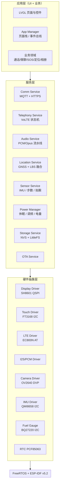
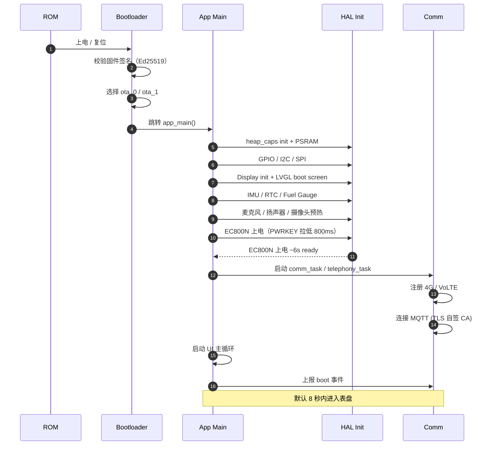
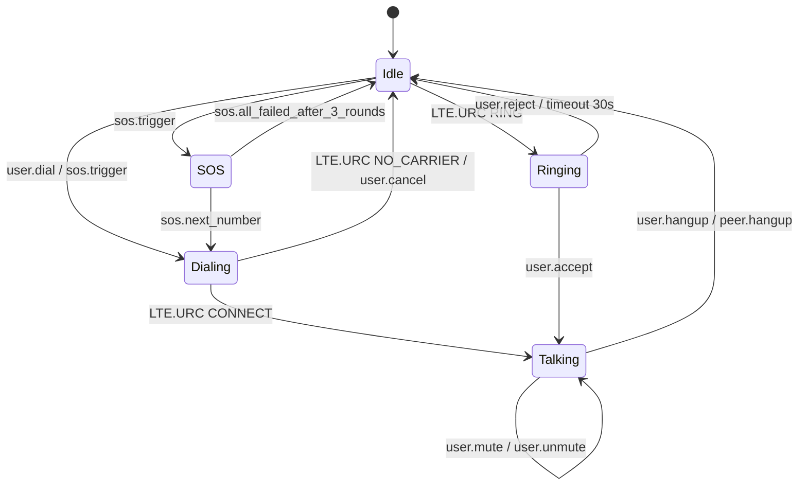
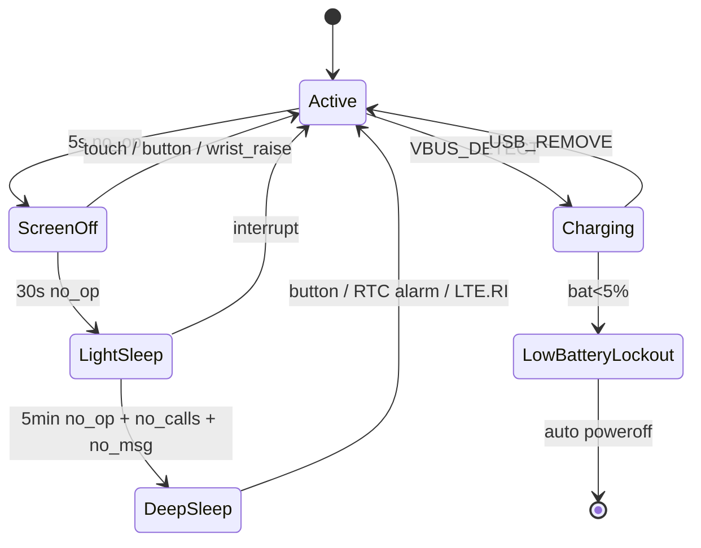
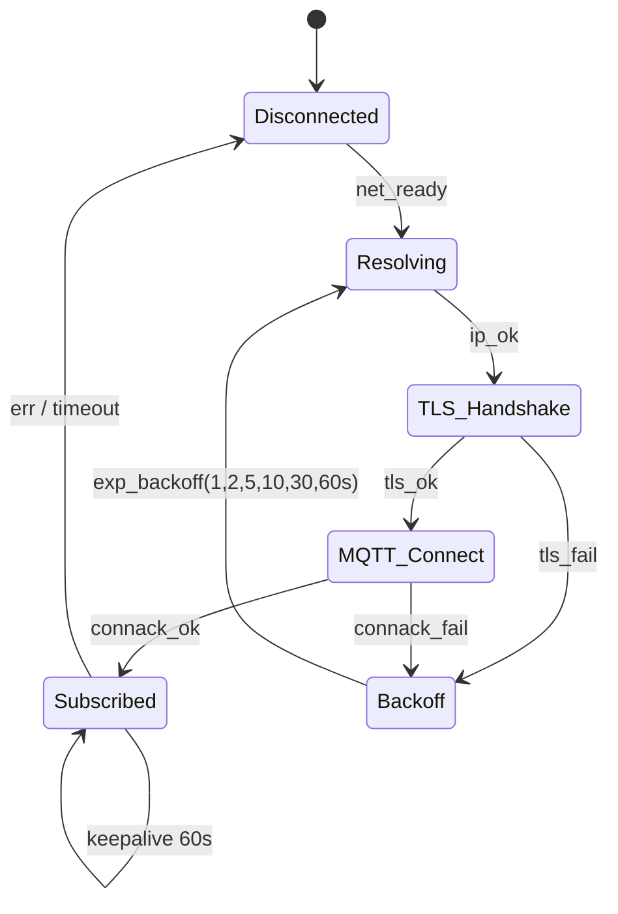
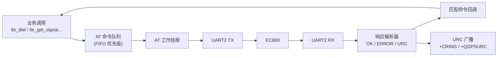
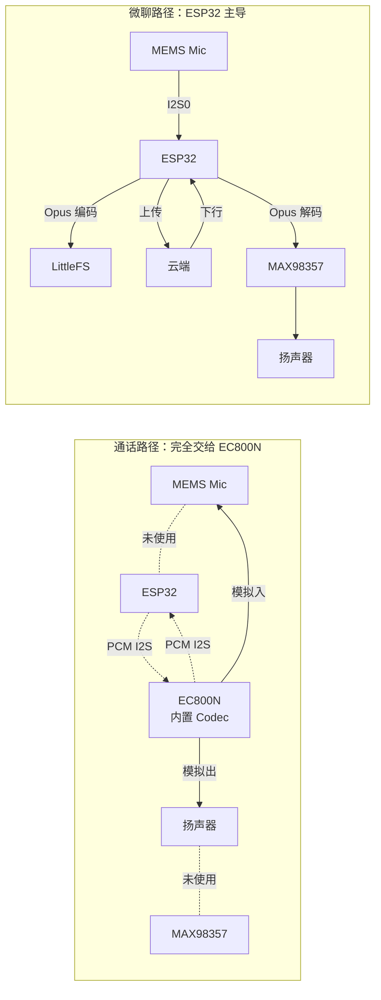
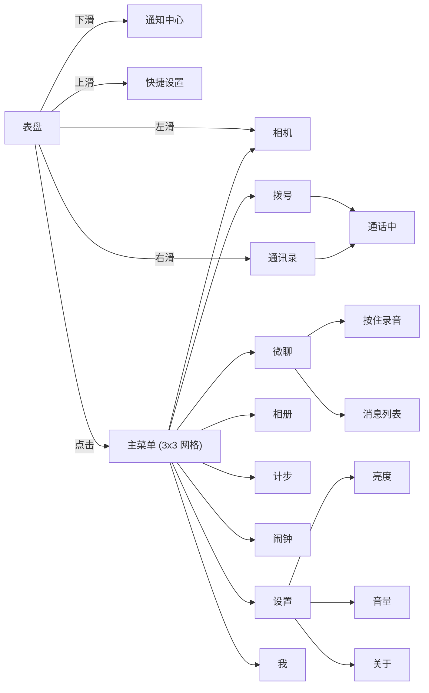
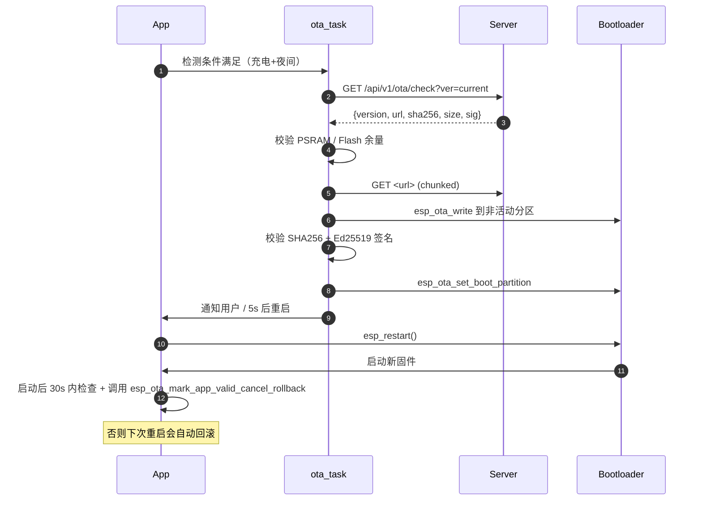

# 04 - 固件架构

> 文档编号：FW
> 适用版本：V1
> 技术栈：ESP-IDF v5.2+ / FreeRTOS / LVGL 9.x / mbedTLS / ESP-MQTT / LittleFS / Opus

---

## 1. 软件分层



---

## 2. Task 划分与优先级

ESP32-S3 双核：CPU0（PRO）默认跑 IDF + Wi-Fi/BT，CPU1（APP）专供应用。

| Task | 优先级（0=低，24=高） | 栈大小 | 绑核 | 职责 |
|---|---|---|---|---|
| `idf_idle_0` | 0 | 1KB | 0 | FreeRTOS IDLE，喂狗 |
| `idf_idle_1` | 0 | 1KB | 1 | FreeRTOS IDLE，喂狗 |
| `lvgl_task` | 5 | 8KB | 1 | LVGL 渲染循环（30Hz tick） |
| `ui_event_task` | 6 | 4KB | 1 | UI 事件分发（触摸 / 按键） |
| `app_mgr_task` | 7 | 6KB | 1 | 业务事件路由 |
| `comm_task` | 8 | 12KB | 0 | MQTT 客户端循环 |
| `telephony_task` | 10 | 8KB | 0 | AT 命令解析 / 通话状态机 |
| `audio_task` | 11 | 8KB | 1 | I2S 采集 / 播放 / Opus 编解码 |
| `location_task` | 7 | 6KB | 0 | NMEA 解析 / LBS / 上报 |
| `sensor_task` | 7 | 4KB | 1 | IMU 中断处理 / 步数算法 |
| `storage_task` | 5 | 4KB | 0 | LittleFS / NVS 异步写 |
| `power_task` | 9 | 4KB | 0 | 电量监测 / 休眠决策 |
| `ota_task` | 4 | 8KB | 0 | OTA 下载 + 校验（按需启动） |
| `watchdog_task` | 12 | 2KB | 0 | 软件看门狗 |

**关键约束**：所有跨 Task 通信必须通过 `xQueue` 或事件组，禁止直接调用其他 Task 内的函数（除非保证线程安全）。

---

## 3. 内存预算

### 3.1 ESP32-S3-WROOM-1U-N16R8 资源

- **Flash**：16 MB → 分区表见 §6
- **内部 SRAM**：512 KB
- **PSRAM**（Octal SPI）：8 MB → 大块缓冲用

### 3.2 PSRAM 8MB 总览

下表 **合计约 3.3～4.0 MB**（依实现微调），**预留 ≥4 MB** 给堆碎片、临时分配与未预见缓存；任一子项超预算须在 P1 实机上用 `heap_caps_get_free_size` / trace 验证。

#### 3.2.1 按模块划分的 PSRAM 预算（V1 目标值）

| 模块 | 细项 | 上限（约） | 说明 |
|------|------|------------|------|
| **LVGL** | 双帧缓冲（466×466 RGB565） | 866 KB | 若省内存可改单缓冲 + 脏区，须测撕裂 |
| | LVGL 堆/内存池（`lv_malloc`） | 512 KB | 复杂表盘、中文字体子集 |
| **显示/采集** | 摄像头 JPEG 行缓冲或整帧 | 512 KB | 可与下项 **时间上互斥**，不同帧共存须降分辨率 |
| **音频 / Opus** | PCM 环形（采集） | 32～64 KB | 单声道 16 kHz |
| | Opus 编码器 workspace + 包缓冲 | 48～64 KB | `libopus` 与帧队列 |
| | 解码/播放缓冲（若边下边播） | 32～64 KB | 可与编码 **互斥** 同一块复用 |
| **蜂窝 AT** | UART RX 环形 + 单条响应缓冲 | 48～64 KB | 长 `+CME` / 超长 URC |
| | AT 命令队列节点池 | 8～16 KB | 异步发令 |
| **网络** | MQTT 客户端 in/out | 128 KB | 大消息场景 |
| | mbedTLS + TCP 发送侧 | 128 KB | `mbedtls_ssl`、会话；可按 IDF 调小 |
| | HTTP 分块上传缓冲 | 128～256 KB | 与 **录音上传** 错峰或复用同一块「大页」 |
| **定位** | NMEA 行缓冲 + 解析结果 | 16～32 KB | |
| | 离线位置 FIFO（LittleFS 仍以块设备为主） | 见下「位置缓存」 | 大块放 PSRAM 仅在队列深度大时 |
| **位置缓存** | 上报队列（PSRAM） | 64～256 KB | 可与网络 HTTP 错峰；缺省 256KB 可降至 128KB |
| **系统** | 业务状态 / 动态 UI 资源 | 余量内 | 避免在 LVGL 回调里大块 `malloc` |

**互斥复用原则**：**拍照整缓冲** 与 **HTTP 大块上传**、**Opus 编码** 不宜三者同时顶格；通过 [§3.5](#35-并发场景与资源优先级) 仲裁。

#### 3.2.2 内部 SRAM 与 DMA（补充）

| 用途 | 大小 |
|---|---|
| Wi-Fi/蓝牙驱动（若开） | 动态，IDF 分配 |
| I2S **DMA 描述符 + 小缓冲** | 尽量放内部或 DMA-capable，**约 8～16 KB** |
| QSPI 屏 DMA | 按驱动，常与 PSRAM 乒乓配合 |

### 3.3 内部 SRAM 分配

| 用途 | 大小 |
|---|---|
| FreeRTOS 内核 + Task 栈合计 | 80 KB |
| BSS / DATA / Heap_caps_internal | 150 KB |
| DMA 缓冲（I2S、QSPI、Camera） | 80 KB |
| 关键 IRAM 函数 | 64 KB |
| 余量 | ~140 KB |

### 3.4 Flash 16MB 分区

```
0x000000  bootloader.bin           (32 KB)
0x008000  partition-table.bin       (4 KB)
0x00d000  nvs                       (24 KB)
0x013000  otadata                   (8 KB)
0x015000  phy_init                  (4 KB)
0x020000  ota_0  app                (6 MB)
0x620000  ota_1  app                (6 MB)
0xc20000  storage   LittleFS        (3.6 MB)
0xfff000  reserved                  (4 KB)
```

- **A/B 双 OTA 分区** 各 6MB（V1 固件预估 4MB，留 50% 余量）
- **LittleFS** 3.6MB（联系人头像、微聊缓存、最近 10 张照片、最近 100 通话记录）

### 3.5 并发场景与资源优先级

当 **LVGL + 蜂窝 + 定位 + 录音/上传 + 拍照** 可能在时间上重叠时，由 **`App Manager` / `resource_arbiter`（建议单例）** 统一裁决，避免 PSRAM 峰值叠加导致 **`heap_caps_alloc` 失败** 或掉帧。

#### 3.5.1 优先级（数字越大越强，高者优先获得独占/大块缓冲）

| 优先级 | 场景 | 行为 |
|--------|------|------|
| **P0（最高）** | **SOS**、看门狗临界、电源即将关机 | 可抢占：暂停非关键任务；释放可重建缓存 |
| **P1** | **录音采集中 + Opus 编码 + 上传**（微聊/语音消息） | **录音链路**：保留 PCM/Opus/HTTP 或 MQTT 载荷缓冲；**GNSS 连续搜星可降频/暂停**；**非紧急 MQTT** 延后 |
| **P2** | **家长「立即定位」**、围栏告警上报 | **短时提升 `location_task`**；可与 P1 互斥：**若正在上传长语音**，定位改为 **LBS 一次** 或 **延后至上传完成**（策略可配置） |
| **P3** | **GNSS 定时 fix**（非 SOS） | 与 P1 冲突时 **跳过本轮或缩短采集窗口** |
| **P4** | **拍照**（JPEG 整帧） | 与 P1 冲突：**队列化**或提示「正在发送语音」；与 LVGL：可 **短暂降帧** |
| **P5** | **后台 MQTT 心跳、异步 OTA 下载** | P1 激活时 **暂停或限速** OTA |
| **P6（最低）** | **LVGL 动画、非紧急刷新** | 允许掉帧；大过渡动画可跳过 |

#### 3.5.2 示例：「定位中同时录音上传」

- **默认策略（推荐）**：**录音/上传优先（P1）**；`location_task` **不关闭模组**，但 **暂停新一轮 GNSS 捕获**（或拉长间隔），已拿到的 **最后有效位置**仍随上传或下一条 MQTT 附带。  
- **例外**：**SOS（P0）** 下 **位置与录音同时保**：优先保证 **一条位置包发出**，再传短录音切片（具体顺序可在 SOS 状态机里固定）。  
- **实现提示**：用 **互斥量**保护「大块 PSRAM 池」（如 256KB 上传页），同刻仅一类使用者；**事件组**通知 `location_task`「进入/退出语音独占窗口」。

#### 3.5.3 验证（与 [00-愿景 §7.1](00-vision.md) 假设对应）

- P1 阶段：在开启 **表盘 + MQTT + 模拟长 AT 回显 + Opus 编码** 时跑 **10 分钟** `heap_caps` / **最小剩余 heap** 日志。  
- 目标：任意 1 s 窗口内 **剩余 PSRAM ≥ 512 KB**（可调）；无 **`ESP_ERR_NO_MEM`**。

---

## 4. 启动流程



### 4.1 启动错误处理

- **PSRAM 初始化失败**：硬错误，闪红屏 3 秒后重启
- **EC800N 不响应**：3 次重试 + 重新上电，仍失败进入"飞行模式"，仅 UI + 离线功能可用
- **MQTT 连接失败**：进入"4G 工作但服务不可达"状态，10 秒退避重试，UI 顶部红色提示

---

## 5. 关键状态机

### 5.1 通话状态机（telephony_task）



事件源：
- `user.*`：UI 触摸事件
- `LTE.URC *`：来自 EC800N 的 +CRING / +CLCC / +CME ERROR 等
- `sos.*`：SOS 模块发出

### 5.2 电源状态机（power_task）



各状态下的功耗目标：
- Active：~80 mA（屏亮）
- ScreenOff：~15 mA（4G+MQTT 连接保持）
- LightSleep：~8 mA（4G PSM + ESP32 light sleep）
- DeepSleep：~3 mA（ESP32 deep sleep + 4G eDRX）

### 5.3 MQTT 连接状态机（comm_task）



---

## 6. LTE 驱动设计（`lte_driver`）

EC800N 通过 UART2 收发 AT 命令，是固件最复杂的模块之一。

### 6.1 模块接口（C API 草案）

```c
typedef enum {
    LTE_NETWORK_NOT_REG,
    LTE_NETWORK_HOME,
    LTE_NETWORK_ROAMING,
    LTE_NETWORK_DENIED,
} lte_network_state_t;

typedef struct {
    int rssi;
    int rsrp;
    int rsrq;
    int sinr;
} lte_signal_t;

esp_err_t lte_init(const lte_config_t *cfg);
esp_err_t lte_dial(const char *phone_number);
esp_err_t lte_answer(void);
esp_err_t lte_hangup(void);
esp_err_t lte_get_signal(lte_signal_t *out);
esp_err_t lte_get_location_lbs(lte_lbs_t *out);

esp_err_t lte_gnss_enable(void);
esp_err_t lte_gnss_disable(void);
esp_err_t lte_gnss_read(lte_gnss_fix_t *out);

esp_err_t lte_data_open(void);    /* PDP context activate */
esp_err_t lte_data_close(void);

typedef void (*lte_event_cb_t)(lte_event_t event, void *data);
esp_err_t lte_register_callback(lte_event_cb_t cb);
```

### 6.2 AT 命令分类

| 类别 | 关键命令 | 备注 |
|---|---|---|
| 初始化 | `AT`, `ATE0`, `AT+CMEE=2`, `AT+CFUN=1` | 关闭回显、长错误码 |
| 网络注册 | `AT+CREG?`, `AT+CGREG?`, `AT+CEREG?` | 注册状态查询 |
| 信号 | `AT+CSQ`, `AT+QENG` | 信号强度 / 基站信息 |
| VoLTE | `AT+QVOLTEIF`, `AT+CIMI`, `AT+QCFG="ims"` | IMS 注册 |
| 通话 | `ATD<num>;`, `ATA`, `ATH`, `AT+CLCC` | 拨号 / 接听 / 挂断 / 查通话 |
| GNSS | `AT+QGPS=1`, `AT+QGPSLOC=2` | 开启 / 读 NMEA |
| 数据 | `AT+QICSGP=1`, `AT+QIACT=1`, `AT+QPING="8.8.8.8"` | PDP 激活 |
| LBS | `AT+QCELLLOC` | 基站定位（需开通 EC800N 自带服务）或自己解析 cellid 上报后端 |
| 短信 | `AT+CMGS`, `AT+CMGR` | V1.1 引入 |

### 6.3 AT 命令调度器



- 一次只有一条 AT 命令在执行
- 业务调用是同步的，但底层用队列异步串行化
- URC（主动上报，如来电）走独立回调路径，不阻塞命令队列
- 每条命令带超时（默认 5s，特殊命令如拨号 30s）

### 6.4 NMEA 解析

EC800N 的 `AT+QGPSLOC=2` 返回类 NMEA 格式：

```
+QGPSLOC: 050043.000,3.20772N,11320.79922E,1.2,123.0,2,000.00,0.0,0.0,310524,06
```

字段：UTC 时间 / 纬度 / 经度 / HDOP / 海拔 / 定位模式 / 航向 / 速度（节）/ 速度（km/h）/ 日期 / 卫星数

需要在 `location_task` 中解析为内部结构体 `lte_gnss_fix_t`。

---

## 7. 音频流水线

### 7.1 两种音频路径



### 7.2 通话路径细节（依赖 EC800N 内置 Codec）

EC800N 的硬件设计推荐之一是**模组直接接麦克风和扬声器**（不经过 ESP32），通过 AT 命令配置音频路径。但本设计选择**通过 PCM 与 ESP32 交互**，理由：

1. 未来要做微聊（需要 ESP32 主导音频）
2. 同一麦克风/扬声器对两条路径复用，减少元件

实现方式：
- EC800N PCM 接口启用：`AT+QDAI=1,1,0,4,0` （PCM master、8kHz、16bit）
- ESP32 I2S 切换：通话时 I2S0/1 路由到 EC800N 的 PCM 引脚
- 业务层调用 `audio_route_set(AUDIO_ROUTE_CALL)` 切换

### 7.3 微聊路径细节

- **采样**：I2S0 从 MEMS 麦克风读取，16kHz/16bit/mono
- **编码**：Opus libopus 1.3.x，bitrate 16kbps，frame 20ms，VBR 模式
- **缓冲**：环形缓冲区 1 秒余量，避免编码慢导致丢帧
- **存储**：录音中实时写 LittleFS（防意外丢失），结束时上传
- **上传**：HTTPS chunked POST，分 16KB 块

### 7.4 Opus 移植注意

- libopus 静态库约 100KB，链接进固件
- 部分代码必须放 IRAM 提速（celt_pitch_xcorr 等）
- ESP-IDF 内置的 Opus 组件（管理组件）已优化，优先用

---

## 8. UI 设计（LVGL 9）

### 8.1 页面树



### 8.2 UI 性能优化点

- **部分刷新**：LVGL `lv_disp_drv_t.full_refresh = 0`，只刷脏区
- **双缓冲**：两个 466×466×2B = 432KB 缓冲交替
- **TE 信号**：屏幕 Tearing Effect 引脚同步，避免撕裂
- **省电**：进入 ScreenOff 状态时调用 `lv_timer_pause()` 完全停止渲染
- **按需加载**：通讯录/相册等大列表用 LVGL `lv_list` 滚动复用控件

### 8.3 字体与图标

- **中文字体**：思源黑体 / 阿里巴巴普惠体子集化（仅常用 800 字 + 数字 + 标点 ≈ 150KB）
- **图标**：FontAwesome 子集或自绘 SVG → 转字体
- **表情**：表盘卡通 PNG 直接嵌入，128×128 RGBA 共 ~64KB × N 张

---

## 9. 存储设计

### 9.1 NVS（4-24KB）

存储小型键值对：

| 命名空间 | 键 | 类型 | 说明 |
|---|---|---|---|
| `cfg` | `device_id` | str(32) | 设备 ID |
| `cfg` | `device_token` | str(512) | JWT |
| `cfg` | `pin` | str(4) | 父母 PIN |
| `cfg` | `volume_call` | u8 | 1-5 |
| `cfg` | `brightness` | u8 | 1-4 |
| `boot` | `boot_count` | u32 | 启动次数 |
| `boot` | `last_panic` | u32 | 最后崩溃时间戳 |
| `loc` | `last_lat` | i32 | 最后定位 |
| `loc` | `last_lng` | i32 | |

### 9.2 LittleFS（3.6MB）

存储中等文件：

```
/contacts/
  contact_001.json      # 联系人元数据
  contact_001_avatar.png
  ...
/messages/
  inbox/                # 最近 50 条收到的
    msg_xxx.opus
    msg_xxx.json
  outbox/               # 最近 10 条发出的（重传用）
/photos/
  thumb_xxx.jpg         # 缩略图
  full_xxx.jpg          # 全图（最近 30 张）
/logs/
  panic.log
  events.log
/config/
  geofence.json
  schedule.json
```

LittleFS 优势：抗掉电、自动 wear leveling、支持目录

---

## 10. OTA 流程

### 10.1 OTA 包格式

```
[Magic 8B 'WatchOTA'][Version 4B][Flags 4B][Size 4B][Reserved 16B]
[App Binary ...]
[Ed25519 Signature 64B]
```

### 10.2 升级流程



### 10.3 差分升级（V1.1）

- 服务端按"上一版本"生成 bsdiff 包
- 手表下载 bsdiff，结合当前分区计算新固件写入另一分区
- 失败回退到全量升级

---

## 11. 安全实现

### 11.1 自签 CA 加载

ESP-IDF 中：

```c
extern const uint8_t ca_pem_start[] asm("_binary_ca_pem_start");
extern const uint8_t ca_pem_end[]   asm("_binary_ca_pem_end");

esp_tls_cfg_t tls_cfg = {
    .cacert_pem_buf = ca_pem_start,
    .cacert_pem_bytes = ca_pem_end - ca_pem_start,
    .common_name = NULL,
    .skip_common_name = false,
};
```

CA PEM 放在 `firmware/main/certs/ca.pem`，通过 component CMakeLists 用 `EMBED_TXTFILES` 嵌入。

### 11.2 设备身份

- 启动时基于 ESP32 efuse `MAC_FACTORY` + 编译时盐计算 `device_id`
- Ed25519 私钥首次开机生成，存 NVS（加密分区）
- 公钥首次开机上报后端绑定，后续所有 API 用签名鉴权

### 11.3 安全启动（V1.1）

V1 暂不启用 Secure Boot V2 + Flash Encryption（为方便调试）。V1.1 进入"准生产"后启用：
- `idf.py menuconfig` 开启 `Enable hardware Secure Boot in bootloader`
- 烧录私钥到 efuse（一次性）
- 启用 Flash 加密

---

## 12. 调试与日志

### 12.1 日志通道

- **本地 UART**：`ESP_LOGI` 等宏，开发期级别 `DEBUG`，生产 `INFO`
- **环形 RAM 日志**：保留最近 4KB 在 PSRAM
- **关键事件远程上报**：ERROR/FATAL 通过 MQTT `watch/{id}/log/up`

### 12.2 单元测试

- ESP-IDF Unity 框架
- 范围：AT 解析器、NMEA 解析器、Opus 包装、状态机转换
- 覆盖率目标：核心模块 ≥ 50%
- CI：GitHub Actions + qemu-xtensa（仅纯逻辑代码）

---

## 13. 工程目录结构

```
firmware/
├── CMakeLists.txt
├── sdkconfig.defaults
├── partitions.csv
├── managed_components/   # ESP-IDF 组件管理器
├── main/
│   ├── CMakeLists.txt
│   ├── app_main.c
│   ├── certs/
│   │   └── ca.pem
│   ├── ui/               # LVGL 页面
│   │   ├── ui_watchface.c
│   │   ├── ui_menu.c
│   │   └── ...
│   ├── services/
│   │   ├── comm/
│   │   ├── telephony/
│   │   ├── audio/
│   │   ├── location/
│   │   ├── sensor/
│   │   ├── power/
│   │   └── storage/
│   └── hal/
│       ├── display/
│       ├── touch/
│       ├── lte/
│       └── ...
├── components/            # 自定义组件
│   ├── lte_driver/
│   ├── opus_wrapper/
│   └── ringbuf_ex/
└── test/
```

---

## 14. 关键时序示例

### 14.1 SOS 触发到拨号成功（目标 ≤ 8s）

```mermaid
gantt
    title SOS 触发时序（典型 4G 良好情况）
    dateFormat X
    axisFormat %s
    section 用户
    长按 SOS 3s :a1, 0, 3000
    section UI
    倒计时 5s 提示 :a2, after a1, 5000
    section 通话
    AT+CMEE / AT+QCFG 检查 :a3, after a2, 500
    ATD<num1>; :a4, after a3, 200
    LTE 等待 CONNECT :a5, after a4, 6000
```



实际：3s 长按 + 5s 倒计时 + 500ms 准备 + 200ms ATD + ~4-6s 接通 ≈ 13s 总流程，**对方电话开始振铃约 3-4s 进入 ATD 后**，符合"长按到拨号成功"≤ 8s 的工程口径。

### 14.2 抬腕到亮屏（目标 ≤ 300ms）

| 步骤 | 时间 |
|---|---|
| QMI8658 角度阈值触发 INT | 0 ms |
| ESP32 ext1 唤醒 + ROM init | 30 ms |
| 屏幕 SH8601 退出睡眠 | 100 ms |
| LVGL 渲染首帧 | 100 ms |
| AMOLED 亮度斜坡 | 50 ms |
| **总计** | **~280 ms** ✅ |

---

**上一篇**：[03 - 硬件设计](03-hardware-design.md)
**下一篇**：[05 - 后端与 APP 架构](05-cloud-and-app.md)
