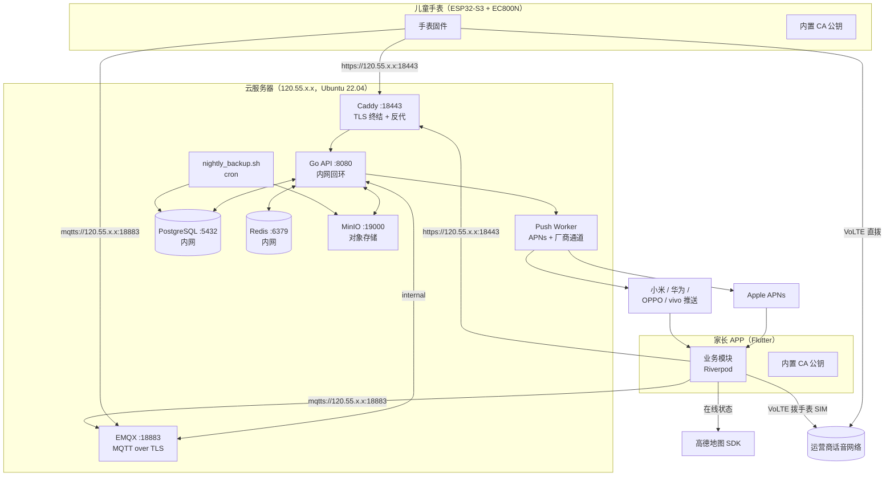
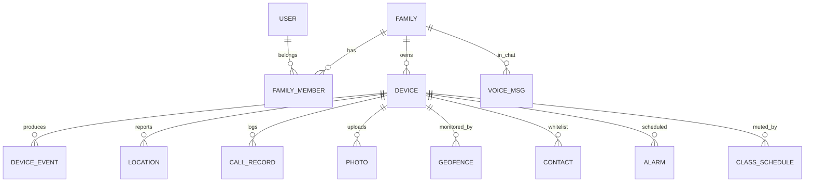
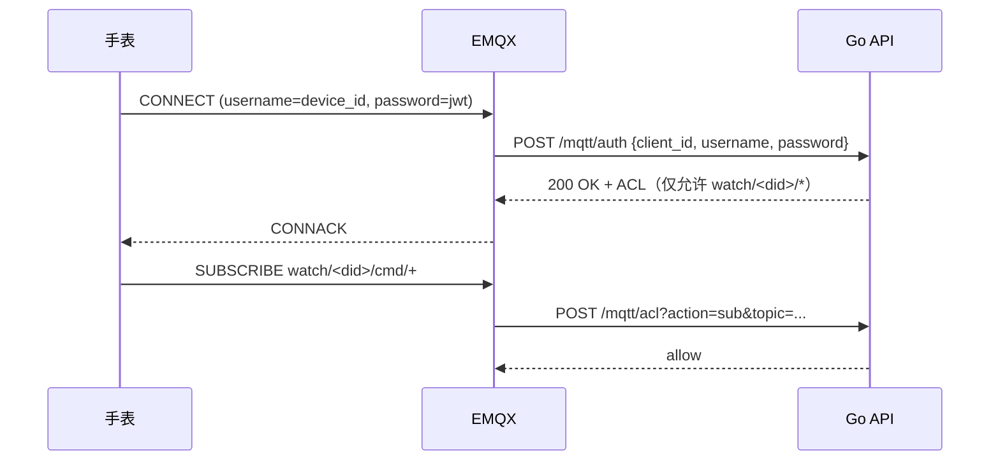
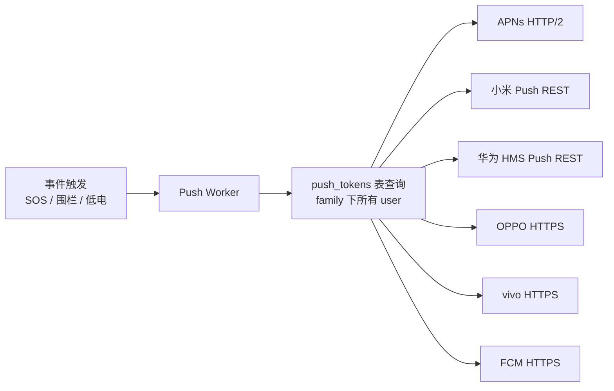
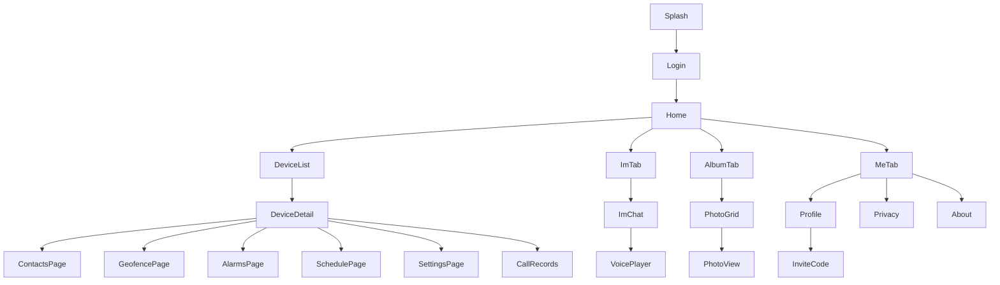
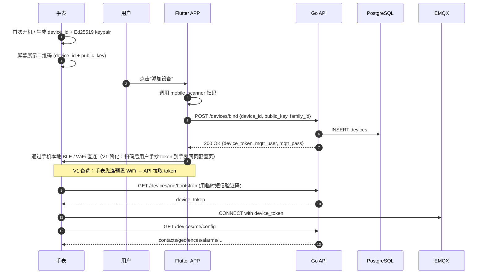
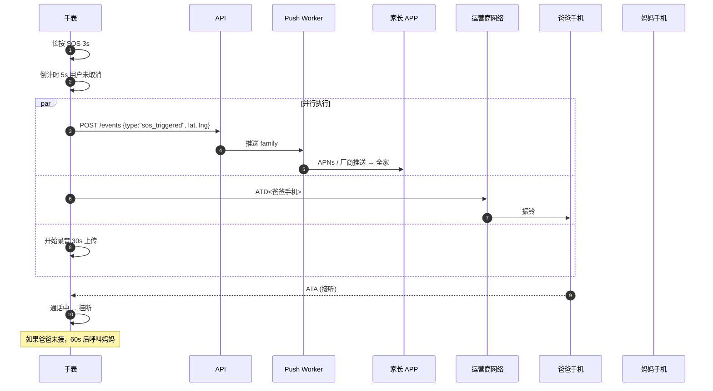
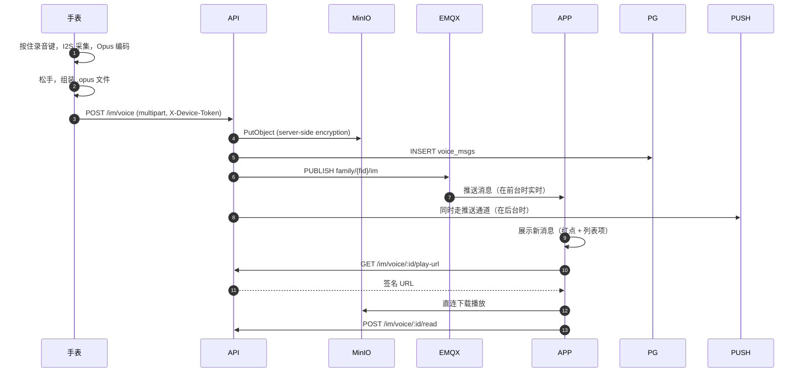

# 05 - 后端与 APP 架构

> 文档编号：CLOUD / APP
> 适用版本：V1
> 后端技术栈：Go 1.22+ / Gin / GORM / PostgreSQL 16 / EMQX 5 / MinIO / Redis / Caddy
> APP 技术栈：Flutter 3.x / Riverpod / 高德地图 SDK

---

## 1. 整体架构



---

## 2. 后端单机部署

### 2.1 服务器目录布局

```
/opt/watch/
├── docker-compose.yml
├── .env                     # 环境变量（脚本读取）
├── caddy/
│   ├── Caddyfile
│   ├── data/                # ACME / 证书缓存
│   └── certs/
│       ├── ca.crt           # 自签 CA 公钥
│       ├── ca.key           # CA 私钥（仅生成证书时用，离线备份）
│       ├── server.crt       # 服务器证书 SAN: IP
│       └── server.key       # 服务器私钥
├── emqx/
│   ├── etc/
│   │   └── emqx.conf
│   └── data/
├── pg/
│   ├── data/
│   └── init.sql
├── minio/
│   ├── data/
│   └── policies/
├── api/
│   ├── docker-image.tag     # 当前部署版本
│   └── logs/
├── backup/
│   ├── nightly.sh
│   └── archives/
└── scripts/
    ├── gen-ca.sh            # 一次性生成 CA
    ├── sign-server.sh       # 给 IP 签证书
    └── rotate-certs.sh      # 证书更新
```

### 2.2 docker-compose.yml（结构示意）

```yaml
version: "3.9"
services:
  caddy:
    image: caddy:2
    restart: unless-stopped
    network_mode: host
    volumes:
      - ./caddy/Caddyfile:/etc/caddy/Caddyfile:ro
      - ./caddy/certs:/etc/caddy/certs:ro
      - ./caddy/data:/data
    depends_on: [api]

  api:
    image: ghcr.io/<you>/watch-api:${API_TAG}
    restart: unless-stopped
    expose: ["8080"]
    environment:
      - DB_DSN=postgres://watch:${PG_PASS}@pg:5432/watch?sslmode=disable
      - REDIS_ADDR=redis:6379
      - MINIO_ENDPOINT=minio:9000
      - EMQX_HTTP=http://emqx:18083
      - JWT_SECRET=${JWT_SECRET}
    depends_on: [pg, redis, minio, emqx]
    volumes:
      - ./api/logs:/var/log/watch

  emqx:
    image: emqx/emqx:5.4
    restart: unless-stopped
    ports:
      - "18883:8883"       # MQTT over TLS（公网）
      - "127.0.0.1:18083:18083"   # 管理面板仅本机
    volumes:
      - ./emqx/etc:/opt/emqx/etc:ro
      - ./emqx/data:/opt/emqx/data
      - ./caddy/certs/server.crt:/opt/emqx/certs/server.crt:ro
      - ./caddy/certs/server.key:/opt/emqx/certs/server.key:ro

  pg:
    image: postgres:16-alpine
    restart: unless-stopped
    expose: ["5432"]
    environment:
      - POSTGRES_USER=watch
      - POSTGRES_PASSWORD=${PG_PASS}
      - POSTGRES_DB=watch
    volumes:
      - ./pg/data:/var/lib/postgresql/data
      - ./pg/init.sql:/docker-entrypoint-initdb.d/init.sql:ro

  redis:
    image: redis:7-alpine
    restart: unless-stopped
    expose: ["6379"]
    command: redis-server --appendonly yes
    volumes:
      - ./redis/data:/data

  minio:
    image: minio/minio:latest
    restart: unless-stopped
    ports:
      - "19000:9000"
      - "127.0.0.1:9001:9001"
    environment:
      - MINIO_ROOT_USER=${MINIO_USER}
      - MINIO_ROOT_PASSWORD=${MINIO_PASS}
    volumes:
      - ./minio/data:/data
    command: server /data --console-address ":9001"
```

### 2.3 Caddyfile（自签证书 + 反代）

```
{
    auto_https off
    admin off
}

:18443 {
    tls /etc/caddy/certs/server.crt /etc/caddy/certs/server.key

    log {
        output file /data/access.log
        format json
    }

    encode zstd gzip

    @api path /api/*
    handle @api {
        reverse_proxy api:8080
    }

    @minio path /oss/*
    handle @minio {
        uri strip_prefix /oss
        reverse_proxy minio:9000
    }

    handle /health {
        respond "ok" 200
    }

    handle {
        respond "watch-server" 200
    }
}
```

### 2.4 自签证书生成脚本（scripts/gen-ca.sh）

```bash
#!/usr/bin/env bash
set -euo pipefail

CERT_DIR=/opt/watch/caddy/certs
mkdir -p "$CERT_DIR"
cd "$CERT_DIR"

# 1. Root CA（10 年）
openssl genrsa -out ca.key 4096
openssl req -x509 -new -nodes -key ca.key -sha256 -days 3650 -out ca.crt \
  -subj "/C=CN/O=Watch DIY/CN=Watch DIY Root CA"

# 2. 服务器证书（5 年，SAN 填公网 IP）
SERVER_IP=$(curl -s ipinfo.io/ip)
openssl genrsa -out server.key 2048
openssl req -new -key server.key -out server.csr \
  -subj "/C=CN/O=Watch DIY/CN=watch-server"

cat > server.ext <<EOF
authorityKeyIdentifier=keyid,issuer
basicConstraints=CA:FALSE
keyUsage=digitalSignature,keyEncipherment
extendedKeyUsage=serverAuth
subjectAltName=IP:${SERVER_IP}
EOF

openssl x509 -req -in server.csr -CA ca.crt -CAkey ca.key -CAcreateserial \
  -out server.crt -days 1825 -sha256 -extfile server.ext

chmod 600 ca.key server.key

echo "Done. ca.crt copied to ../../../firmware/main/certs/ca.pem and ../../../app/assets/certs/ca.pem"
```

CA 私钥（ca.key）一旦生成后**离线备份到 U 盘 + 1Password**，服务器上保留 0600 权限。

---

## 3. 数据模型

### 3.1 ER 图



### 3.2 主要表结构（PostgreSQL）

```sql
-- 用户（家长）
CREATE TABLE users (
    id           BIGSERIAL PRIMARY KEY,
    phone        VARCHAR(20) UNIQUE NOT NULL,
    nickname     VARCHAR(50),
    avatar_url   TEXT,
    created_at   TIMESTAMPTZ NOT NULL DEFAULT now(),
    updated_at   TIMESTAMPTZ NOT NULL DEFAULT now()
);

-- 家庭
CREATE TABLE families (
    id           BIGSERIAL PRIMARY KEY,
    name         VARCHAR(100),
    owner_id     BIGINT NOT NULL REFERENCES users(id),
    created_at   TIMESTAMPTZ NOT NULL DEFAULT now()
);

-- 家庭成员关系
CREATE TABLE family_members (
    family_id    BIGINT NOT NULL REFERENCES families(id) ON DELETE CASCADE,
    user_id      BIGINT NOT NULL REFERENCES users(id) ON DELETE CASCADE,
    role         VARCHAR(20) NOT NULL,  -- owner / parent / grandparent
    joined_at    TIMESTAMPTZ NOT NULL DEFAULT now(),
    PRIMARY KEY (family_id, user_id)
);

-- 设备
CREATE TABLE devices (
    id           BIGSERIAL PRIMARY KEY,
    device_id    VARCHAR(64) UNIQUE NOT NULL,
    family_id    BIGINT NOT NULL REFERENCES families(id),
    sn           VARCHAR(64) UNIQUE,
    fw_version   VARCHAR(20),
    sim_phone    VARCHAR(20),
    public_key   TEXT NOT NULL,
    nickname     VARCHAR(50),
    bound_at     TIMESTAMPTZ NOT NULL DEFAULT now(),
    last_seen_at TIMESTAMPTZ,
    INDEX idx_devices_family (family_id)
);

-- 位置上报
CREATE TABLE locations (
    id           BIGSERIAL PRIMARY KEY,
    device_id    BIGINT NOT NULL REFERENCES devices(id) ON DELETE CASCADE,
    lat          DOUBLE PRECISION NOT NULL,
    lng          DOUBLE PRECISION NOT NULL,
    accuracy     REAL,
    speed        REAL,
    heading      REAL,
    source       VARCHAR(10) NOT NULL,  -- gnss / lbs / wifi
    battery      SMALLINT,
    reported_at  TIMESTAMPTZ NOT NULL,
    INDEX idx_locations_device_time (device_id, reported_at DESC)
);

-- 通话记录
CREATE TABLE call_records (
    id           BIGSERIAL PRIMARY KEY,
    device_id    BIGINT NOT NULL REFERENCES devices(id),
    direction    VARCHAR(10) NOT NULL,  -- in / out / missed
    peer_phone   VARCHAR(20),
    peer_name    VARCHAR(50),
    duration_s   INT NOT NULL DEFAULT 0,
    started_at   TIMESTAMPTZ NOT NULL,
    INDEX idx_calls_device_time (device_id, started_at DESC)
);

-- 微聊消息
CREATE TABLE voice_msgs (
    id           BIGSERIAL PRIMARY KEY,
    family_id    BIGINT NOT NULL REFERENCES families(id),
    sender_type  VARCHAR(10) NOT NULL,  -- watch / parent
    sender_id    BIGINT NOT NULL,       -- device.id 或 user.id
    object_key   TEXT NOT NULL,         -- MinIO 路径
    duration_ms  INT NOT NULL,
    size_bytes   INT NOT NULL,
    read_by      BIGINT[] DEFAULT '{}', -- 读过的成员 id
    created_at   TIMESTAMPTZ NOT NULL DEFAULT now(),
    INDEX idx_voice_family_time (family_id, created_at DESC)
);

-- 照片
CREATE TABLE photos (
    id           BIGSERIAL PRIMARY KEY,
    device_id    BIGINT NOT NULL REFERENCES devices(id),
    object_key   TEXT NOT NULL,
    thumb_key    TEXT NOT NULL,
    width        INT,
    height       INT,
    size_bytes   INT,
    taken_at     TIMESTAMPTZ NOT NULL,
    INDEX idx_photos_device_time (device_id, taken_at DESC)
);

-- 通讯录白名单
CREATE TABLE contacts (
    id           BIGSERIAL PRIMARY KEY,
    device_id    BIGINT NOT NULL REFERENCES devices(id) ON DELETE CASCADE,
    name         VARCHAR(50) NOT NULL,
    phone        VARCHAR(20) NOT NULL,
    avatar_url   TEXT,
    sort_order   INT NOT NULL DEFAULT 0,
    is_sos       BOOLEAN NOT NULL DEFAULT false,
    sos_order    SMALLINT,
    UNIQUE (device_id, phone)
);

-- 电子围栏
CREATE TABLE geofences (
    id           BIGSERIAL PRIMARY KEY,
    device_id    BIGINT NOT NULL REFERENCES devices(id) ON DELETE CASCADE,
    name         VARCHAR(100) NOT NULL,
    center_lat   DOUBLE PRECISION NOT NULL,
    center_lng   DOUBLE PRECISION NOT NULL,
    radius_m     INT NOT NULL,
    enabled      BOOLEAN NOT NULL DEFAULT true,
    created_at   TIMESTAMPTZ NOT NULL DEFAULT now()
);

-- 闹钟
CREATE TABLE alarms (
    id           BIGSERIAL PRIMARY KEY,
    device_id    BIGINT NOT NULL REFERENCES devices(id) ON DELETE CASCADE,
    label        VARCHAR(100),
    time_hhmm    VARCHAR(5) NOT NULL,  -- "07:30"
    repeat_mask  SMALLINT NOT NULL,    -- bit0=周一 ... bit6=周日
    enabled      BOOLEAN NOT NULL DEFAULT true,
    ringtone     VARCHAR(20),
    vibrate      BOOLEAN NOT NULL DEFAULT true
);

-- 上课禁用时段
CREATE TABLE class_schedules (
    id           BIGSERIAL PRIMARY KEY,
    device_id    BIGINT NOT NULL REFERENCES devices(id) ON DELETE CASCADE,
    weekday      SMALLINT NOT NULL,    -- 1-7
    start_hhmm   VARCHAR(5) NOT NULL,
    end_hhmm     VARCHAR(5) NOT NULL
);

-- 设备事件流（围栏、SOS、低电等）
CREATE TABLE device_events (
    id           BIGSERIAL PRIMARY KEY,
    device_id    BIGINT NOT NULL REFERENCES devices(id) ON DELETE CASCADE,
    event_type   VARCHAR(40) NOT NULL,
    payload      JSONB,
    occurred_at  TIMESTAMPTZ NOT NULL,
    INDEX idx_events_device_time (device_id, occurred_at DESC)
);

-- 推送通道 token
CREATE TABLE push_tokens (
    id           BIGSERIAL PRIMARY KEY,
    user_id      BIGINT NOT NULL REFERENCES users(id) ON DELETE CASCADE,
    platform     VARCHAR(20) NOT NULL,  -- apns / xiaomi / huawei / oppo / vivo / fcm
    token        TEXT NOT NULL,
    bundle_id    VARCHAR(100),
    updated_at   TIMESTAMPTZ NOT NULL DEFAULT now(),
    UNIQUE (user_id, platform, token)
);
```

### 3.3 索引与查询

主要查询场景：
- 实时位置：`SELECT ... WHERE device_id=? ORDER BY reported_at DESC LIMIT 1`（命中 `idx_locations_device_time`）
- 历史轨迹：`SELECT ... WHERE device_id=? AND reported_at BETWEEN ? AND ? ORDER BY reported_at`
- 微聊列表：`SELECT ... WHERE family_id=? ORDER BY created_at DESC LIMIT 50`
- 通话记录：`SELECT ... WHERE device_id=? ORDER BY started_at DESC LIMIT 100`

PG 表分区（V1.1 视数据增长引入）：`locations` 按月分区。

---

## 4. REST API 契约

### 4.1 通用规范

- Base URL：`https://120.55.x.x:18443/api/v1`
- 鉴权：
  - 用户接口：Header `Authorization: Bearer <user_jwt>`
  - 设备接口：Header `X-Device-Token: <device_jwt>`
- 返回：JSON，统一结构 `{code: int, msg: string, data: any}`
- 时间：所有 timestamp 为 RFC3339 UTC

### 4.2 关键端点列表

| 路径 | 方法 | 鉴权 | 说明 |
|---|---|---|---|
| `/auth/sms-code` | POST | 无 | 申请短信验证码 |
| `/auth/login` | POST | 无 | 短信验证码登录 |
| `/auth/refresh` | POST | user | 刷新 JWT |
| `/auth/logout` | POST | user | 登出 |
| `/users/me` | GET | user | 获取自己信息 |
| `/users/me` | PATCH | user | 更新昵称 / 头像 |
| `/users/me/push-token` | PUT | user | 上报推送 token |
| `/families` | GET | user | 获取我加入的家庭列表 |
| `/families` | POST | user | 创建家庭 |
| `/families/:id/invite-code` | POST | user(owner) | 生成邀请码 |
| `/families/:id/join` | POST | user | 通过邀请码加入 |
| `/families/:id/members` | GET | user | 成员列表 |
| `/families/:id/members/:uid` | DELETE | user(owner) | 移除成员 |
| `/devices/bind` | POST | user | 扫码绑定设备 |
| `/devices/:id` | GET | user | 设备详情 |
| `/devices/:id` | DELETE | user(owner) | 解绑（二次验证） |
| `/devices/:id/contacts` | GET/POST | user | 通讯录管理 |
| `/devices/:id/contacts/:cid` | PATCH/DELETE | user | 单条联系人 |
| `/devices/:id/geofences` | GET/POST | user | 围栏管理 |
| `/devices/:id/alarms` | GET/POST | user | 闹钟管理 |
| `/devices/:id/class-schedules` | GET/PUT | user | 上课时段 |
| `/devices/:id/locations` | GET | user | 历史轨迹 `?from=&to=` |
| `/devices/:id/locate-now` | POST | user | 即时定位（下发 MQTT 命令） |
| `/devices/:id/call-records` | GET | user | 通话历史 |
| `/devices/:id/photos` | GET | user | 相册分页 |
| `/devices/:id/photos/:pid` | DELETE | user | 删除照片 |
| `/im/voice` | POST | user/device | 上传录音 |
| `/im/voice` | GET | user | 微聊历史分页 |
| `/im/voice/:id/read` | POST | user | 标记已读 |
| `/photos` | POST | device | 设备上传照片 |
| `/locations` | POST | device | 设备上报位置（备用 HTTP，主用 MQTT） |
| `/events` | POST | device | 设备上报事件 |
| `/ota/check` | GET | device | OTA 检查 `?ver=` |
| `/ota/download/:id` | GET | device | 下载 OTA 包 |

详细 OpenAPI 规范见 [`server/api/openapi.yaml`](../server/api/openapi.yaml)（V1 第 7 周交付）。

### 4.3 错误码（前 4 位为 HTTP 类）

| code | 说明 |
|---|---|
| 0 | 成功 |
| 4001 | 参数错误 |
| 4010 | 未登录 / Token 失效 |
| 4011 | Token 已过期，请刷新 |
| 4030 | 无权访问该资源 |
| 4040 | 资源不存在 |
| 4090 | 资源冲突（如手机号已注册） |
| 4290 | 频率限制（短信、登录） |
| 5000 | 服务器内部错误 |
| 5030 | 上游服务不可用（EMQX / MinIO） |

---

## 5. MQTT Topic 规约

EMQX 中所有 topic 走 TLS。每台设备一个客户端，每个用户一个客户端。

### 5.1 命名约定

```
watch/<device_id>/...    设备上行 / 服务端下行
app/<user_id>/...        APP 上行 / 服务端下行
family/<family_id>/...   家庭组广播
```

### 5.2 上行（设备 → 服务端）

| Topic | QoS | 内容 | 说明 |
|---|---|---|---|
| `watch/{did}/location/up` | 0 | `{lat, lng, acc, ..., t}` | 高频，丢一帧可接受 |
| `watch/{did}/status/up` | 1 | `{battery, signal, charging, online}` | 每分钟 |
| `watch/{did}/event/up` | 1 | `{type, payload, t}` | SOS / 围栏 / 低电 |
| `watch/{did}/im/up` | 1 | `{msg_id, ack}` | 微聊已读回执 |
| `watch/{did}/log/up` | 1 | `{level, tag, msg, t}` | 关键日志 |

### 5.3 下行（服务端 → 设备）

| Topic | QoS | 内容 | 说明 |
|---|---|---|---|
| `watch/{did}/cmd/locate` | 1 | `{request_id}` | 触发即时定位 |
| `watch/{did}/cmd/reboot` | 1 | `{request_id}` | 远程重启 |
| `watch/{did}/cmd/ota` | 1 | `{url, sha256, sig, force}` | 触发 OTA |
| `watch/{did}/im/down` | 1 | `{msg_id, url, duration, sender}` | 微聊下发 |
| `watch/{did}/sync/contacts` | 1 | `{version, contacts:[]}` | 通讯录同步 |
| `watch/{did}/sync/geofences` | 1 | 同上 | 围栏同步 |
| `watch/{did}/sync/alarms` | 1 | 同上 | 闹钟 |
| `watch/{did}/sync/schedule` | 1 | 同上 | 上课时段 |
| `watch/{did}/sync/config` | 1 | `{volume, brightness, ...}` | 设置 |

### 5.4 家庭组广播

| Topic | 内容 | 订阅者 |
|---|---|---|
| `family/{fid}/im` | 微聊消息广播 | 所有家长 APP |
| `family/{fid}/event` | 设备事件（SOS、围栏） | 所有家长 APP |

### 5.5 鉴权与 ACL

EMQX 集成 HTTP 鉴权：
- 设备连接：客户端 ID = `device_<id>`，username = `device_id`，password = `device_jwt` → EMQX 调用 `POST /api/v1/mqtt/auth` 验证
- ACL：每个连接只能订阅 / 发布自己 `did` / `fid` 下的 topic（防越权）



---

## 6. 推送通道

iOS APNs 与 Android 各厂商通道差异巨大，需要分平台处理。

### 6.1 推送路由



### 6.2 各通道账号成本

| 通道 | 成本 | 备注 |
|---|---|---|
| Apple APNs | 99 美元/年（Apple Developer 账号） | iOS 必备 |
| 小米推送 | 免费 | 需企业开发者 |
| 华为推送（HMS） | 免费 | 个人也可申请 |
| OPPO 推送 | 免费 | |
| vivo 推送 | 免费 | |
| FCM | 免费 | 国内不稳定 |

**实际取舍**：V1 先做 APNs（iPhone 用户）+ 小米推送（你的手机），其他厂商通道在确实需要时补。

### 6.3 推送内容规范

- 标题：≤ 20 字
- 正文：≤ 50 字
- 不含具体坐标、不含人名（脱敏），如：
  - "宝贝触发了 SOS" ✅
  - "宝贝在 39.9087°N 116.3975°E 触发 SOS" ❌
- 点击跳转 APP 内对应页面

---

## 7. 家长 APP 架构（Flutter）

### 7.1 工程目录

```
app/
├── pubspec.yaml
├── lib/
│   ├── main.dart
│   ├── core/
│   │   ├── api/              # Dio + 自签 CA pinning
│   │   ├── mqtt/             # mqtt_client
│   │   ├── push/             # 各平台推送
│   │   ├── storage/          # Hive + secure_storage
│   │   ├── auth/             # Token 管理
│   │   └── theme/
│   ├── features/
│   │   ├── auth/             # 登录注册
│   │   ├── home/             # 首页（地图+卡片）
│   │   ├── device/           # 设备管理
│   │   ├── call/             # 通话集成
│   │   ├── im/               # 微聊
│   │   ├── album/            # 相册
│   │   ├── geofence/         # 围栏
│   │   ├── contact/          # 通讯录
│   │   ├── alarm/            # 闹钟
│   │   ├── schedule/         # 上课时段
│   │   ├── notification/     # 通知中心
│   │   └── settings/         # 设置
│   ├── shared/
│   │   ├── widgets/
│   │   └── utils/
│   └── gen/                  # 自动生成（i18n、assets）
├── assets/
│   ├── certs/
│   │   └── ca.pem
│   ├── images/
│   └── lang/
├── ios/
├── android/
└── test/
```

### 7.2 状态管理

使用 **Riverpod 2.x**：
- `AsyncNotifierProvider` 处理异步状态
- `StreamProvider` 订阅 MQTT 流（位置 / 事件 / 微聊）
- 全局状态：当前用户、当前家庭、设备列表

### 7.3 关键组件

| 组件 | 实现方式 |
|---|---|
| 地图 | `amap_flutter_map`（国内体验最好） |
| 录音 | `record` 包 + Opus 编码（`flutter_opus` 或自接 native） |
| 录音播放 | `just_audio` |
| 推送（iOS） | `flutter_apns_only` |
| 推送（小米/华为） | `xiao_mi_push_plugin` + `huawei_push` |
| 网络 | `dio` + 自签 CA pinning |
| MQTT | `mqtt_client` |
| 持久化 | `hive`（一般数据）+ `flutter_secure_storage`（token） |
| 二维码扫描 | `mobile_scanner` |
| 通话集成 iOS | `flutter_callkit_incoming` + 系统拨号器 |

### 7.4 信息架构（IA）



### 7.5 自签 CA pinning（Dart）

```dart
class TrustedHttpClient {
  static Future<Dio> create() async {
    final caPem = await rootBundle.loadString('assets/certs/ca.pem');
    final ctx = SecurityContext(withTrustedRoots: false);
    ctx.setTrustedCertificatesBytes(utf8.encode(caPem));

    final adapter = IOHttpClientAdapter()
      ..createHttpClient = () {
        final client = HttpClient(context: ctx);
        client.badCertificateCallback = (cert, host, port) => false; // 严格
        return client;
      };

    final dio = Dio(BaseOptions(
      baseUrl: 'https://120.55.x.x:18443/api/v1',
      connectTimeout: const Duration(seconds: 10),
      receiveTimeout: const Duration(seconds: 30),
    ));
    dio.httpClientAdapter = adapter;
    return dio;
  }
}
```

### 7.6 平台特定配置

**iOS（Info.plist）**：
- ATS 例外（自签证书）：`NSAllowsArbitraryLoads = false`、`NSExceptionDomains` 中添加 `120.55.x.x` 例外
- 后台模式：voip / fetch / remote-notification
- 位置权限：`NSLocationWhenInUseUsageDescription`（地图） / `NSLocationAlwaysAndWhenInUseUsageDescription`（围栏告警）
- 麦克风权限（录音）
- 相机权限（扫码绑定设备）

**Android（AndroidManifest.xml）**：
- 自签证书：`network_security_config.xml` 中信任 `ca.pem`
- 权限：网络、定位、麦克风、相机、振动
- 厂商推送 channel 注册

---

## 8. 关键流程时序

### 8.1 设备绑定



**V1 简化路径**：首次开机让手表通过 EC800N 4G 拨号 `*#bootstrap` 短代码或访问预置 URL `https://120.55.x.x:18443/api/v1/devices/bootstrap?sn=xxx`，自动完成绑定。

### 8.2 SOS 完整流程



### 8.3 微聊（手表 → 家长）



---

## 9. 监控与备份

### 9.1 监控指标（V1.1 引入完整栈）

V1 用最简方式：
- **EMQX 内置 Dashboard**：MQTT 连接数、消息速率
- **PostgreSQL `pg_stat_database`**：查询次数、慢查询
- **MinIO 内置控制台**：对象数、容量
- **API 自身**：内置 `/metrics` (Prometheus exposition format)
- **告警**：`/opt/watch/scripts/healthcheck.sh` 每 5 分钟跑一次，失败发钉钉/Telegram bot

V1.1：引入 Prometheus + Grafana + Loki（已有 31G 内存够用）。

### 9.2 备份策略

**每天 04:00（cron）**：

```bash
#!/usr/bin/env bash
# /opt/watch/backup/nightly.sh
set -euo pipefail
DATE=$(date +%Y%m%d)
BACKUP=/opt/watch/backup/archives/$DATE
mkdir -p $BACKUP

# PostgreSQL
docker exec watch-pg pg_dump -U watch -d watch \
  | gzip > $BACKUP/pg-watch.sql.gz

# MinIO（增量 rclone）
rclone sync \
  /opt/watch/minio/data/ $BACKUP/minio/ \
  --transfers 8

# Caddy 证书与 CA（小文件）
tar -czf $BACKUP/caddy-certs.tar.gz /opt/watch/caddy/certs/

# 保留 30 天
find /opt/watch/backup/archives/ -maxdepth 1 -mtime +30 -exec rm -rf {} \;
```

**每周日**：将 `archives/` 同步到本地 NAS 或 Cloudflare R2（rclone）。

### 9.3 灾难恢复

- 服务器整机崩：从最近 archives 恢复 PG dump + MinIO 数据 + 自签证书；启动 docker compose
- CA 私钥丢失：所有手表与 APP 都需重新部署新 CA → 严重事故，私钥必须 1Password + U 盘双备份

---

## 10. 接下来的工程任务（已在 plan 中跟踪）

短期 P0：
1. 服务器上初始化目录、生成 CA、生成服务器证书
2. 写 docker-compose.yml 与 Caddyfile，跑通最简 `/health`
3. Go API 脚手架，实现 `/auth/sms-code` + `/auth/login`
4. Flutter APP 脚手架，跑通登录
5. 设备绑定流程联调（先用本地模拟 device_id）

详细任务分解见 `.cursor/plans/diy_儿童手表项目计划_15f5c880.plan.md`。

---

**上一篇**：[04 - 固件架构](04-firmware-architecture.md)
**回到首页**：[README](../README.md)
